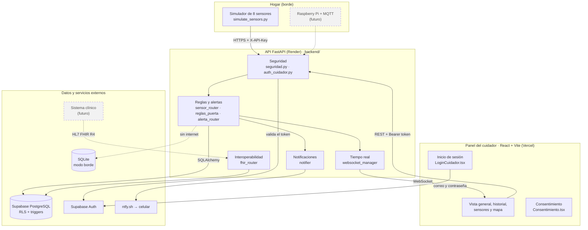
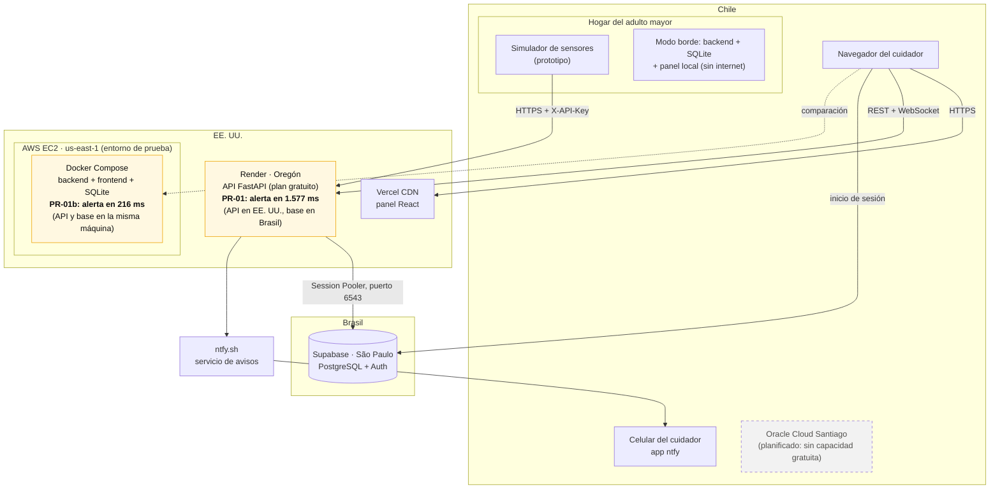
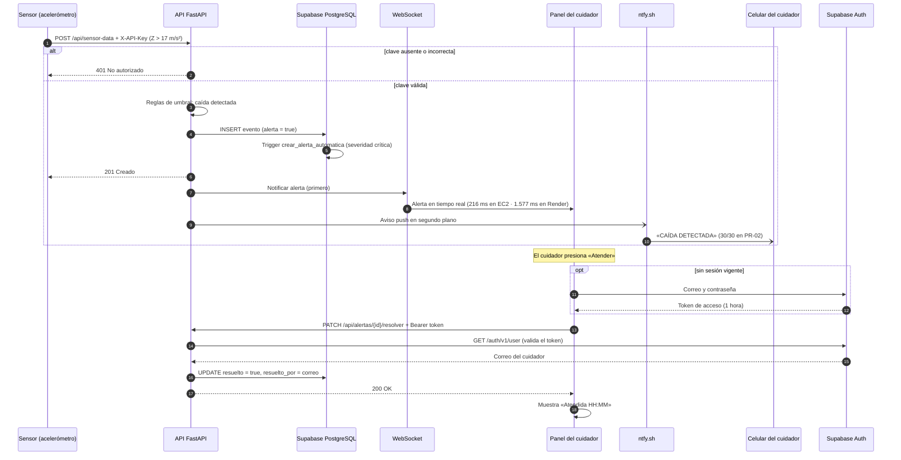
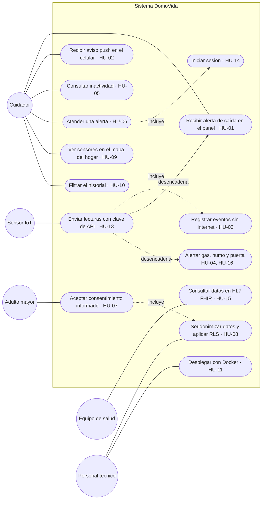
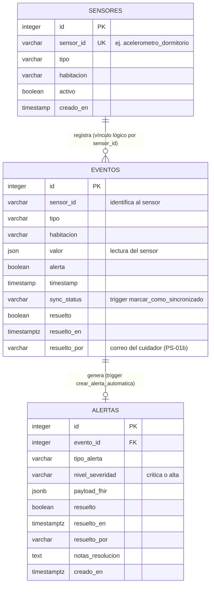
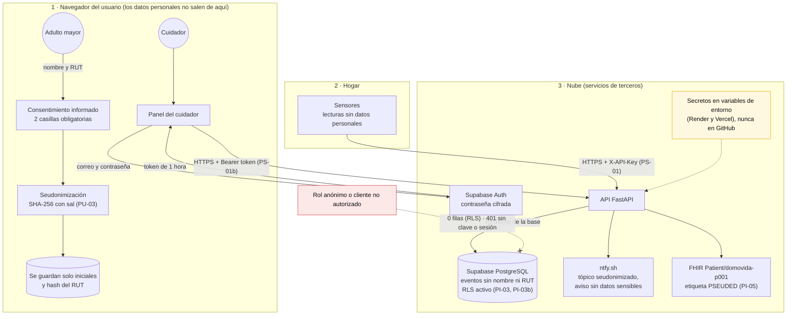
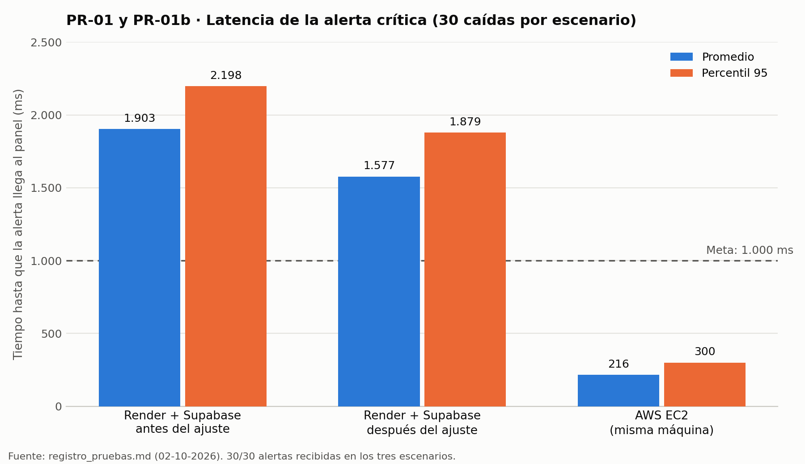

# DomoVida · Diagramas de diseño

Diagramas del proyecto según la Guía de apoyo del estudiante (secciones 6.1 Arquitectura, 6.2 Modelo de datos, 6.3 UML mínimo, 6.5 Requisitos no funcionales en el diseño y 7.5 Pruebas de rendimiento). Actualizados al 6 de octubre de 2026.

Cada diagrama está en dos formatos: el código **Mermaid** (`.mmd`), que GitHub muestra como imagen en esta página y se puede editar como texto, y una imagen **PNG** para insertar en informes y presentaciones.

| N° | Diagrama | Sección de la guía | Archivos |
|---|---|---|---|
| 1 | Arquitectura de componentes | 6.1 y 6.3 | `01_componentes.mmd` · `.png` |
| 2 | Despliegue (infraestructura) | 6.1 | `02_despliegue.mmd` · `.png` |
| 3 | Secuencia del flujo crítico | 6.3 | `03_secuencia_flujo_critico.mmd` · `.png` |
| 4 | Casos de uso | 6.3 | `04_casos_de_uso.mmd` · `.png` |
| 5 | Modelo de datos (entidad-relación) | 6.2 | `05_modelo_datos.mmd` · `.png` |
| 6 | Flujo de datos personales y seguridad | 6.5 | `06_datos_personales_seguridad.mmd` · `.png` |
| 7 | Gráfico de latencia PR-01 / PR-01b | 7.5 | `07_latencia_pr01.png` · `07_latencia.py` |

---

## 1. Arquitectura de componentes

**Qué representa:** las partes del sistema y cómo se comunican. Los sensores del hogar envían lecturas a la API FastAPI; la API aplica seguridad, reglas de detección y alertas, guarda en Supabase (o en SQLite sin internet) y avisa al panel por WebSocket y al celular por ntfy.

**Decisiones de diseño que muestra:** una API única como punto de entrada (*API-first*) con la seguridad en la puerta de entrada (clave de API para sensores y sesión para el cuidador); separación entre las salidas en tiempo real (WebSocket), push (ntfy) e interoperabilidad (FHIR); persistencia doble nube/borde. Los componentes punteados (Raspberry Pi con MQTT y sistema clínico) son trabajo futuro: hoy los sensores son simulados.

## 2. Despliegue (infraestructura)

**Qué representa:** dónde corre cada parte. El panel está en Vercel, la API en Render (Oregón, EE. UU.), la base de datos y la autenticación en Supabase (São Paulo, Brasil), y un entorno de prueba con Docker en AWS EC2 (Virginia, EE. UU.).

**Decisión de diseño que muestra:** explica el hallazgo principal de rendimiento. Con la API y la base de datos en continentes distintos, la alerta tarda 1.577 ms en promedio (PR-01); con ambas en la misma máquina, 216 ms (PR-01b). Por eso se planificó un despliegue en Oracle Cloud Santiago, hoy postergado por falta de capacidad gratuita en la región.

## 3. Secuencia del flujo crítico

**Qué representa:** el recorrido completo de una caída, en orden: la lectura del sensor (con su clave), la detección, el registro en la base, el trigger que crea la alerta, el aviso por WebSocket y por ntfy, y la atención del cuidador con su sesión.

**Decisiones de diseño que muestra:** el WebSocket se envía **antes** que ntfy y ntfy en segundo plano, lo que redujo la latencia en 17 % (commit 1c8c203); la alerta se crea con un trigger en la base de datos, no con un segundo INSERT desde Python; el token del cuidador se valida contra Supabase Auth en cada atención y su correo queda registrado.

## 4. Casos de uso

**Qué representa:** qué puede hacer cada actor (cuidador, adulto mayor, sensor, equipo de salud y personal técnico), con la historia de usuario del Product Backlog que corresponde a cada caso.

**Decisiones de diseño que muestra:** atender una alerta **incluye** iniciar sesión (HU-14); aceptar el consentimiento **incluye** la seudonimización (HU-08); una lectura de sensor desencadena las alertas de caída, gas, humo o puerta. El diagrama usa la notación de casos de uso adaptada a Mermaid (actores en círculos y casos en óvalos).

## 5. Modelo de datos (entidad-relación)

**Qué representa:** las tres tablas de Supabase/PostgreSQL con sus columnas reales (consultadas en `information_schema` el 06-10-2026) y sus relaciones.

**Decisiones de diseño que muestra:** `alertas.evento_id` es clave foránea de `eventos.id`, y cada alerta la crea el trigger `crear_alerta_automatica` con su severidad; `eventos.sync_status` lo marca el trigger `marcar_como_sincronizado`; la relación entre `sensores` y `eventos` es lógica (por `sensor_id`), sin clave foránea, para que un sensor nuevo pueda enviar datos antes de registrarse. Ninguna tabla guarda nombre ni RUT.

**Observación de diseño:** las columnas de atención (`resuelto`, `resuelto_en`, `resuelto_por`) existen en `eventos` y en `alertas`, pero la API actualiza solo las de `eventos`. Es una redundancia que conviene resolver (registro de pruebas, ajuste 17).

## 6. Flujo de datos personales y seguridad

**Qué representa:** por dónde viajan los datos y qué control se aplica en cada punto, en tres zonas: el navegador del usuario, el hogar y la nube.

**Decisiones de diseño que muestra (privacidad por diseño, Ley N° 21.719):** el nombre y el RUT se seudonimizan en el navegador y no llegan a la base de datos; los sensores envían lecturas sin datos personales y con clave (PS-01); el cuidador se autentica con Supabase Auth y usa un token de 1 hora (PS-01b); RLS bloquea al rol anónimo (PI-03 y PI-03b); el aviso de ntfy no lleva datos sensibles; FHIR expone solo un seudónimo con la etiqueta PSEUDED (PI-05); los secretos viven en variables de entorno y nunca en GitHub.

## 7. Gráfico de latencia PR-01 / PR-01b

**Qué representa:** el tiempo hasta que la alerta llega al panel en 30 caídas por escenario, con el promedio y el percentil 95, frente a la meta de 1.000 ms.

**Conclusión:** el ajuste del orden de las notificaciones bajó el promedio de 1.903 a 1.577 ms, pero solo la infraestructura con API y base de datos juntas (AWS EC2, 216 ms) cumple la meta. El gráfico se genera con `07_latencia.py` a partir de los datos de `registro_pruebas.md`.

